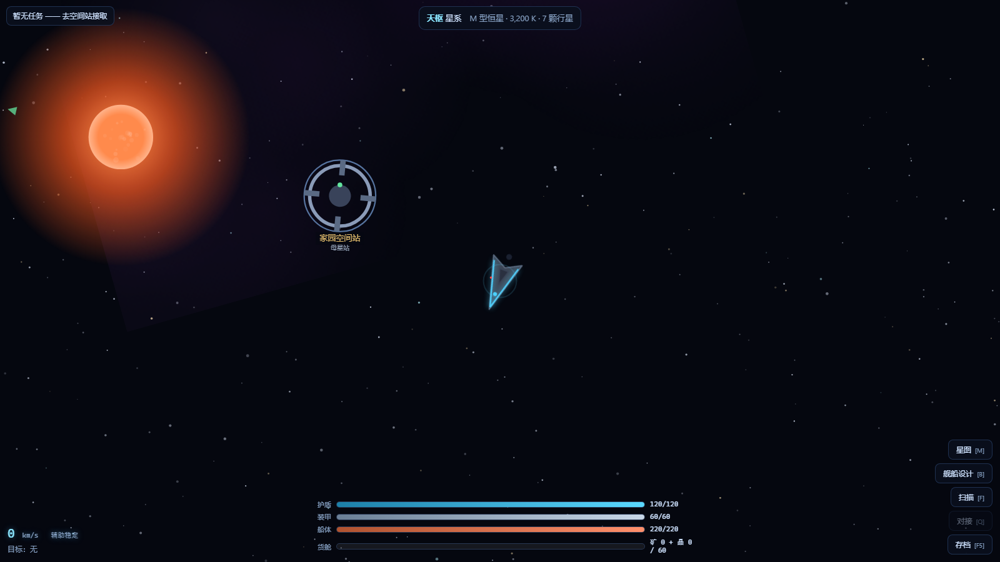

# 星海远航 · STELLAR VOYAGER

> 一款自包含的网页太空飞船飞行模拟游戏：程序化银河 · 详细行星系统 · 群星式舰船设计 · 勘探采矿贸易战斗 · 超空间跃迁
>
> **运行方式**：直接双击 `index.html` 即可游玩（无需服务器、无需联网、无任何外部依赖）
>
> **🌐 在线游玩**：<https://zunyiqingfeng-code.github.io/stellar-voyager/>（GitHub Pages 部署，存档保存在浏览器本地）

---

## 一、游戏概述

你是指挥官，驾驶旗舰「远航号」从母星系「天枢」出发，沿超空间航道探索整片银河。
勘探行星获取科研点、开采小行星积累矿物、在空间站贸易补给、设计并建造更强的战舰、
清剿盘踞在星带中的海盗、完成空间站任务板上的委托——直到你的舰队足以纵横星海。

- **游戏类型**：2D 太空飞行模拟 + 探索/建造/战斗（4X 元素）
- **操作方式**：键鼠（WASD + 鼠标）
- **技术栈**：原生 JavaScript + Canvas 2D + DOM UI，零依赖，约 20 个模块
- **存档**：localStorage 自动/手动存档，刷新不丢进度

---

## 二、核心玩法循环

```
            ┌──────────────────────────────────────────┐
            ▼                                          │
   勘探行星 ──▶ 科研点 ──▶ 科技等级↑ ──▶ 解锁更强部件      │
      │                                          │      │
      ├──▶ 发现异常 ──▶ 选择事件 ──▶ 资源/科研奖励 ─┴──────┤
      │                                                  │
   采矿小行星 ──▶ 矿物/稀有晶体 ──▶ 空间站出售 ──▶ 信用点 ─┤
      │                                          │      │
   击毁海盗 ──▶ 赏金+合金+掉落 ◀── 舰船设计/建造/修理 ◀────┤
      │                                          │      │
   空间站任务板（清剿/勘探/采矿/信使）──▶ 奖励 ────────────┘
      │
   超空间跃迁 ──▶ 新星系（新行星/新资源/更强海盗/更高奖励）
```

**成长曲线**：科技等级 I~V 由累计科研点解锁（阈值 0 / 250 / 900 / 2400 / 5500），
每级开放更强的武器、护盾、引擎与更大的舰体；越危险的星系奖励越高，海盗越强。

---

## 三、银河与恒星系（详细设定）

### 3.1 银河生成
- 128 星系螺旋银河（4 旋臂 + 银心聚团），种子化程序生成，同一存档永远同一片银河
- 星系由**超空间航道**连接（最小生成树保证全图连通 + 近邻航道），枢纽星系最多 6 条航道
- 战争迷雾：只有到访过的星系可见，相邻星系显示为"未探明"轮廓

### 3.2 恒星光谱型（10 类，按真实天文学配色）
| 光谱 | 颜色 | 表面温度 | 亮度 | 特征 |
|------|------|---------|------|------|
| M 红矮星 | 橙红 | 3,200 K | 0.02 | 最常见、最暗淡、长寿 |
| K 橙矮星 | 橙 | 4,800 K | 0.25 | 温和稳定 |
| G 黄矮星 | 金黄 | 5,800 K | 1.0 | 与太阳同类 |
| F 黄白星 | 米白 | 6,800 K | 2.8 | 宜居带更远 |
| A 白星 | 纯白 | 8,500 K | 12 | 炽热短命 |
| B 蓝白巨星 | 蓝白 | 15,000 K | 120 | 强辐射 |
| O 蓝超巨星 | 蓝 | 32,000 K | 900 | 银河最炽烈 |
| WD 白矮星 | 青白 | 12,000 K | 0.01 | 致密残骸 |
| NS 中子星 | 脉冲蓝 | 600,000 K | 0.005 | 旋转射束，残骸带资源惊人 |
| BH 黑洞 | 黑+吸积盘 | — | — | 连光都无法逃脱 |
| RG 红巨星 | 深红 | 3,500 K | 60 | 膨胀中，吞没内行星 |

### 3.3 行星生成（16 种类型）
行星按**真实辐射平衡温度**决定类型：`T = 278 × √(L / r²)`（r 为轨道半径，单位 AU），
再叠加概率骰产出特殊世界：

| 类型 | 温度带 | 大气 | 宜居度 | 资源倾向 |
|------|--------|------|--------|----------|
| 熔岩世界 | >1500℃ | SO₂/硫蒸气 | 0% | 矿物 |
| 荒芜世界 | >430℃ | 无/稀薄 CO₂ | 0% | 矿物 |
| 沙漠世界 | 300-430℃ | CO₂ | 40% | 能量 |
| 干旱世界 | 250-430℃ | N₂/O₂稀薄 | 60% | 矿物 |
| 大陆世界 | 250-420℃ | N₂/O₂ | 80% | 均衡 |
| 海洋世界 | 250-420℃ | N₂/O₂湿润 | 75% | 科研 |
| 苔原世界 | 170-330℃ | N₂/O₂稀薄 | 55% | 科研 |
| 冰封世界 | <180℃ | N₂/CH₄ | 20% | 科研 |
| 气态巨行星 | 外轨道 | H₂/He | — | 能量（含大红斑/风暴带贴图） |
| 冰巨星 | 外轨道 | H₂/He/CH₄ | — | 能量 |
| 盖亚世界 | 1.2% 概率 | 完美 N₂/O₂ | 100% | 稀有 |
| 死寂世界 | 2.2% | 辐射尘 | 0% | 稀有 |
| 机械世界 | 3.2% | 工业废气 | 30% | 稀有 |
| 蜂巢世界 | 4.2% | 孢子云 | 10% | 稀有 |
| 剧毒世界 | 5.4% | 氨/甲烷 | 0% | 稀有 |
| 破碎世界 | 6.8% | 尘埃 | 0% | 矿物 |

**每颗行星的完整数据块**：名称 / 类型 / 半径(km) / 质量(M⊕) / 表面重力(g) / 温度(℃) /
大气成分 / 自转周期 / 轨道半径(AU) / 宜居度 / 卫星数量 / 资源储量(矿物·能量·科研·稀有) /
独特地貌（熔岩海、大红斑、钻石雨区、失落城市遗址等 40+ 种风味文案）。

**卫星与环带**：气态巨星带 1-4 颗卫星、大岩质行星带 1-2 颗；35% 巨星 / 10% 岩质行星有光环；
行星系中随机一条轨道间隙生成 40-90 块可开采小行星（个别藏有稀有晶体）。

**异常事件（7 种）**：远古文明遗迹、轨道残骸群、未知信号源、量子裂隙、虫群孢囊、遗落方舟、
海盗藏宝库——扫描后弹出二选一抉择，A/B 选项收益不同。

### 3.4 程序化贴图
值噪声 + 分形布朗运动逐像素绘制：大陆/海洋阈值划分、纬度冰盖、云层、陨石坑、
熔岩裂纹辉光、气态行星环带扭曲 + 大红斑。**渲染时动态叠加恒星方向昼夜阴影与大气辉光**，
行星在轨道上公转、自转，环形世界缓慢旋转。

---

## 四、舰船系统（参考《群星》）

### 4.1 舰体（6 种，科技等级解锁）
| 舰体 | 解锁 | 船体 | 槽位（武器/防御/核心/辅助） | 航速 | 特性 |
|------|------|------|------------------------------|------|------|
| 护卫舰 | I | 220 | 3S / 3 / 5 / 1 | 320 | 高闪避 30% |
| 驱逐舰 | II | 480 | 2S+2M / 4 / 5 / 2 | 250 | 均衡 |
| 巡洋舰 | III | 950 | 3S+2M+1L / 6 / 6 / 3 | 200 | 可挂大口径主炮 |
| 战列舰 | IV | 1900 | 2S+2M+3L / 6 / 7 / 4 | 150 | 移动要塞 |
| 科研船 | I | 160 | 1S / 2 / 5 / 2 | 290 | 勘探效率 +50% |
| 采矿船 | I | 190 | 1S / 2 / 5 / 3 | 240 | 货舱 400、采矿效率 +60% |

### 4.2 部件系统（86 种部件 × 科技等级 I~V）
- **武器槽（S/M/L 三种口径）**：
  - **动能系**（质量加速器→线圈炮→轨道炮→高斯炮→动能撕裂者 / 重装线直至**千兆加农炮**）：对护盾 ×1.25、对装甲 ×0.75
  - **能量系**（红激光→蓝激光→紫外线→X射线→伽马激光 / 重型粒子长矛→等离子加农→**湮灭光束**）：对护盾 ×0.5、对装甲 ×1.5
  - **导弹系**（核导弹→聚变→反物质→量子→奇点 / 鱼雷线直至**湮灭鱼雷**）：制导追踪，会被点防御拦截，重创船体
  - **点防御**（高炮→机关炮→双管→激光点防→相位点防）：极高射速，优先拦截来袭导弹
- **防御槽**：护盾（可再生的偏导护盾 I~V，受击 4 秒后开始充能）、装甲（不可再生的合金→龙鳞）、船体强化（+20/40/70%）
- **核心槽**：反应堆（聚变→奇点核心，供电力）/ 推进器（化学→反物质，航速/机动/闪避）/
  超光速引擎（曲速→奇点跳跃，跃迁距离 1-5 跳、充能 3.0-1.6 秒）/ 作战电脑（射速×1.0-1.38、命中率）/ 探测器（扫描距离 500-1300m、勘探效率）
- **辅助槽**：护盾电容（+50% 护盾再生）、辅助火控、跃迁稳定器、后燃加力器、勘测套件、货舱扩容、强化船壳

### 4.3 电力与装配
每个部件消耗电力，反应堆供能——**超载无法保存设计**（与《群星》一致的约束）。
设计器实时校验：槽位尺寸、科技等级、电力平衡；显示 DPS/护盾/装甲/船体/航速/机动/闪避/
扫描/跃迁/货舱/造价全属性汇总。保存后旗舰自动按新设计重新装配。

### 4.4 伤害管线
```
命中判定（线段-圆碰撞，防高速穿透）
  → 闪避判定（闪避率 - 目标追踪）
  → 护盾吸收（按武器护盾倍率）→ 护盾击穿
  → 装甲吸收（按武器装甲倍率）→ 装甲击穿
  → 船体伤害 → 船体 ≤0 则舰船损毁
```
海盗 AI 状态机：巡逻 → 狩猎（索敌 1300m）→ 攻击（环绕 260-460m 射击）→ 逃逸（船体<30%）；
海盗也会用点防御拦截玩家的导弹。

---

## 五、玩法系统细节

### 5.1 飞行手感（牛顿物理）
- 推进/制动沿舰艏方向施力，惯性漂移，**辅助稳定模式（默认）** 自动阻尼，N 键切换**纯惯性模式**
- T 巡航（4.2× 航速、机动减半）· 按住 X **曲速充能飞行**（1.3s 充能，15000px/s，战斗中禁用）
- 恒星高温区灼烧船体、行星/小行星碰撞伤害（撞击速度越高伤害越大）、近站减速才能对接
- 滚轮缩放 0.14×-6×，相机速度前视；屏幕边缘箭头指向目标/空间站/最近未勘探行星

### 5.2 勘探
靠近行星按 F（或右键点击）开始扫描，进度 = 0.4/秒 × 勘探效率；完成后行星全数据解锁，
奖励 20 + 科研资源×6 科研点（未勘探前数据为估算值），首次扫描可能触发异常抉择。

### 5.3 采矿
鼠标左键瞄准 300m 内小行星发射采矿光束，每 0.12s 采得 0.9 × 采矿效率 单位矿石；
矿脉枯竭后小行星消失，稀有矿有概率掉晶体；**采矿声会引来海盗**（危险星系 30% 概率伏击）。

### 5.4 空间站（Q 对接）
贸易（矿 3/单位、晶体 130，可购合金）· 修理（按缺口计费）· 船坞（建造设计→入库→切换旗舰→拆解返 40%）·
任务板（4 类委托：清剿海盗/勘探指定行星/采矿订单/信使跃迁）· 情报（星系与银河概览）。

### 5.5 银河星图（M）
航道网络 + 迷雾 + 跃迁范围高亮；点击可达星系 → 充能（受超光速引擎与跃迁稳定器影响）→
超空间跃迁动画 → 抵达新星系外缘。跃迁距离 = 引擎等级（1-5 跳）。

### 5.6 音效（WebAudio 全合成，零资源文件）
引擎低频轰鸣（随推力变调）、动能/激光/导弹开火、护盾与船体受击、爆炸、扫描滴答、
曲速充能、跃迁、停靠、UI 提示音、警报——首次点击后解锁（浏览器自动播放策略）。

---

## 六、操作指南

| 按键 | 功能 | | 按键 | 功能 |
|------|------|-|------|------|
| W/↑ | 推进 | | S/↓ | 制动 |
| A/D | 左/右转向 | | Shift | 加力 |
| T | 巡航模式 | | X(按住) | 曲速飞行 |
| N | 惯性/辅助模式切换 | | O | 轨道线显示 |
| 鼠标左键 | 采矿光束 | | 鼠标右键 | 锁定行星 |
| 空格 | 集火目标 | | E / Tab | 切换敌舰目标 |
| F | 扫描行星 | | Q | 空间站对接 |
| M / J | 银河星图 | | B | 舰船设计器 |
| Esc | 暂停菜单 | | 滚轮 | 缩放视野 |

## 七、技术架构

```
index.html ── css/style.css（深空主题 UI）
js/
  core/     引擎：rand(种子随机+值噪声) math input audio(合成器) save engine(主循环+场景) ui(DOM面板)
  data/     names(命名生成) components(86部件库) ships(舰体+装配校验)
  world/    galaxy(旋臂+航道) system(行星系统生成) planettex(程序化贴图)
  render/   starfield(星空视差+恒星绘制) fx(粒子池+光束+爆炸) ship(矢量舰船)
  scenes/   boot menu flight(核心玩法) combat(武器/弹道/伤害/AI) galaxymap(星图+跃迁)
            designer(舰船设计器) station(空间站)
  main.js  状态初始化/存档/造船运行时
test/      冒烟测试(smoke.js) + CDP 浏览器端到端测试(cdp-qa.js, 32 项断言)
qa/        无头浏览器截图
```

- 单文件自包含：纯 script 标签加载（file:// 协议可直接运行，无需模块服务器）
- 确定性生成：银河/行星按种子可复现；行星贴图懒生成并缓存
- 场景即状态机（boot→menu→flight⇄galaxymap），UI 面板（设计器/空间站）以模态层叠加暂停
- 对象池：粒子池（上限 1400）、弹道数组复用、离屏画布缓存（舰船/行星贴图）
- 引擎级异常隔离：场景回调异常只记录不中断主循环，避免单帧错误杀死游戏

## 八、质量保障（已执行的测试）

| 套件 | 覆盖 | 结果 |
|------|------|------|
| test/smoke.js（Node 无头） | 银河连通性/命名多样性/行星数据完整性/部件合法性/装配校验/电力平衡/伤害管线守恒/护盾再生/闪避/弹道碰撞 | ✔ 全通过 |
| test/cdp-qa.js（真实浏览器 CDP） | 完整游戏流程 33 项断言：初始化→扫描→勘探结算→星图(可见性)→超空间跃迁→设计器开合→对接贸易→任务板→修理→战斗(伤害/击杀/赏金)→存档读档 | ✔ 33/33 |
| test/ui-qa.js（主菜单/弹窗回归） | 冷启动主菜单→新的远征→继续航行恢复→设计器内层弹窗关合后可继续操作→确认框→新游戏 | ✔ 20/20 |
| test/playtest.js（真实输入试玩） | 真实键盘事件(WSAD/F/Q/M/T/Esc)+真实鼠标点击驱动完整流程：菜单→飞行→扫描→对接→星图点击跃迁→巡航→暂停 | ✔ 14/14 |
| 无头截图 + 像素探针 | 三场景渲染验证（亮度/色相直方图/HUD 文本） | ✔ |

### v1.0.2 修复记录（星图专项）
- **星图相机污染（核心）**：引擎渲染使用飞行相机的变换矩阵，而星图使用独立坐标系——从飞行场景进入星图后整个星图被上一个相机的缩放/位移污染（星点偏移、缩放错乱）。修复：星图场景创建时清零引擎相机，所有绘制改用显式 setTransform 完全解耦；主菜单同样修复
- **星图视觉增强**：银心光晕、已到访星系名称常显（此前默认缩放下无名）、未探明星点提亮加微光描边、跃迁范围内星系显示可达虚线光环、星系光点尺寸随恒星真实半径放大
- **星图 HUD 性能**：信息栏由每帧 innerHTML 重绘改为 0.3s 节流
- **回归断言**：新增像素级渲染验证（当前星系与相邻星系必须点亮在数学坐标处，4/4 通过；屏幕↔世界坐标往返一致）

### v1.0.1 修复记录
- **弹窗层叠失活**：任意弹窗关闭都会移除模态层的 active 状态，导致设计器等外层面板"看得见点不动"（内层选择器关闭后卡死）。改为弹窗注册表，仅当栈空时失活；closeAll 逐个触发 onClose 保持外部状态一致
- **开始游戏回退主菜单**：boot 初始化完成后错误返回 menu，导致"继续航行"永远弹回主菜单。现在 继续航行→恢复飞行、新的远征→直接起航、冷启动→主菜单 三条路径分离
- **首访自动存档**：newGame 不再立即写档，首次访问菜单不再出现误导性的"继续航行"
- **星图信息栏不可见**：飞行场景离开时隐藏 HUD 容器，星图却向其写入信息导致整条信息栏隐形；现由星图场景自行管理显隐
- **tooltip 层级**：调整 z-index，悬停提示不再覆盖模态面板
- **存档损坏防御**：读档时缺舰船设计自动回退默认设计

## 九、数值速查

- 科技阈值：I=0 / II=250 / III=900 / IV=2400 / V=5500 科研点
- 伤害倍率：动能(盾1.25/甲0.75) 能量(盾0.5/甲1.5) 导弹(盾0.6/甲0.6,可拦截)
- 护盾充能：受击 4 秒后启动，基础再生 3-15/秒（电容 +50%）
- 闪避：护卫舰 30% 基础 + 推进器/电脑加成 − 敌方追踪
- 造价：武器 40×口径×等级² 信用点 + 9×口径×等级 合金；三级起需稀有晶体
- 海盗：等级 = 星系危险度×2.5+1（最高 III），赏金 60-500+
- 任务奖励：随科技等级与距离缩放

## 十、游戏截图

| 主菜单 | 星系内飞行 | 银河星图 |
|--------|-----------|----------|
|  |  |  |

## 十一、开源协议

MIT License © 2026 zunyiqingfeng-code —— 自由使用、修改、分发，保留版权声明即可。
欢迎提 Issue / PR。

## 十二、开发路线图（已完成 → 未来）

- [x] v1.0 全部核心系统（本文档所述）
- [ ] 舰队编队（多舰同屏、护卫僚机）
- [ ] 阵营/外交（海盗、商帮、远古守门人）
- [ ] 行星殖民与资源开发站
- [ ] 泰坦/主宰级舰体与 X 槽超级武器
- [ ] 手柄支持与移动端适配

---
*STELLAR VOYAGER v1.0 · 一个午后从零写就的星海 · 双击 index.html，起航。*